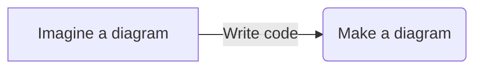

---
---

# Study Workspace

You can use this template to create a study workspace for taking and saving notes in studies.

This template is intended to be built with [Jekyll](https://jekyllrb.com/).


## Supported syntax

### Markdown

Markdown syntax in `.md` files compiled by [Jekyll](https://jekyllrb.com/) is supported.

```markdown
# Heading 1
## Heading 2
### Heading 3
#### Heading 4
##### Heading 5
###### Heading 6
```

A paragraph with *italic* and **bold** text.  
A second line with _italic_ and __bold__ text.

```markdown
A paragraph with *italic* and **bold** text.  
A second line with _italic_ and __bold__ text.
```

Inline code with `console.log("Hello World!");`

```markdown
Code block with `console.log("Hello World!");`
```

etc...

### Additional Markdown syntax

~Subscript~ and ^superscript^

```markdown
~Subscript~ and ^superscript^
```

==Highlighted== text

```markdown
==Highlighted== text
```

### KaTeX math syntax

Katex is a library for rendering TeX mathematical expressions in HTML.

See the KaTeX documentation for more information:
- [KaTeX Supported Functions](https://katex.org/docs/supported.html)
- [KaTeX Support Table](https://katex.org/docs/support_table.html)

Inline equations are rendered with `$`.  
Block equations are rendered with `$$`.

$y = ax + b$

$$y = ax + b$$

```markdown
$y = ax + b$
$$y = ax + b$$
```

### Mermaid diagrams

Mermaid is a library for rendering flowcharts in HTML.

See the [Mermaid documentation](https://mermaid-js.github.io/mermaid/) for more information.



Mermaid diagrams are rendered with mermaid code blocks:

```markdown
```mermaid
```
